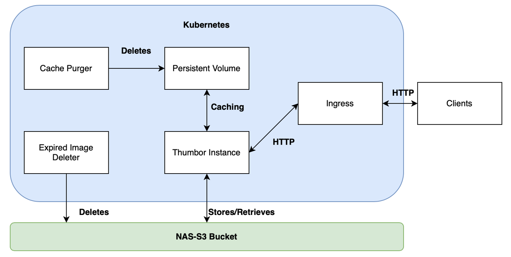

# Diamond Image Service

## Introduction

The Diamond Image Service processes and manage images dynamically within a Kubernetes environment. This service uses Thumbor, an open-source photo thumbnail service, to provide features for image visualization, resizing, reformatting, and storage management via a NAS-S3 bucket.

## Technical Architecture



## Clients
Clients can be any device or system that makes HTTP requests to the service. They interact with the Thumbor instance through web requests to process and retrieve images as specified by the URL parameters they include.

## Ingress  
The Ingress acts as the entry point for all requests from clients to the services running within the Kubernetes cluster. It manages external access to the services, routing traffic to the appropriate internal components.

## Thumbor Instance 
This is the core component where the image processing tasks are executed. It runs as a containerized application within Kubernetes and is scaleable.

## Persistent Volume 
The Persistent Volume (PV) is used for managing storage resources that need to persist beyond the lifecycle of individual pods. It is used for caching images and persists through restarts and deployments. No matter how many instances of Thumbor are running they will all share the same volume. The cache purger deletes from the same volume.

## Cache Purger
This component is responsible for clearing the cache in the Persistent Volume. It ensures that cached images modified more than 7 days ago and accessed more than 1 day ago are removed from the cache. This is run on a schedule that is executed on the hour, every hour.

## Expired Image Deleter
The Expired Image Deleter removes images from the NAS-S3 bucket that have reached their expiration date, as defined by the lifespan parameter during upload. Here's an example of how to set an image's lifespan during an upload:

```bash
curl -X PUT -F "media=@dahlia-8546849_1280.jpg" "http://image-service.diamond.ac.uk/unsafe/upload?lifespan=<number of days>"
```

## NAS-S3 Bucket
This component is the external storage system where images are ultimately stored and retrieved from.

## Demonstrating Functionality

The Diamond Image Service supports several functionalities, accessible through structured URLs. The following is a subset of the many manipluations Thumbor supports:

Resizing
Resize an image to 300x200 pixels:
```bash
https://image-service.diamond.ac.uk/unsafe/300x200/filename.jpg
```

Changing Image Formats
Convert an image to PNG:
```bash
https://image-service.diamond.ac.uk/unsafe/300x200/filename.jpg.png
```

Cropping Images
Crop an image to focus on a specific area:
```bash
https://image-service.diamond.ac.uk/unsafe/100x100:200x200/filename.jpg
```

Rotating Images
Rotate an image by 90 degrees:
```bash
https://image-service.diamond.ac.uk/unsafe/filters:rotate(90)/filename.jpg
```

Applying Filters
Apply a grayscale filter:
```bash
https://image-service.diamond.ac.uk/unsafe/filters:grayscale()/filename.jpg
```

## Contributing
For getting setup for local testing, refer to the [Developer Guide](/docs/developer_setup.md)

For deployment setup please refer to the [Deployment Guide](/docs/deployment_guide.md) 